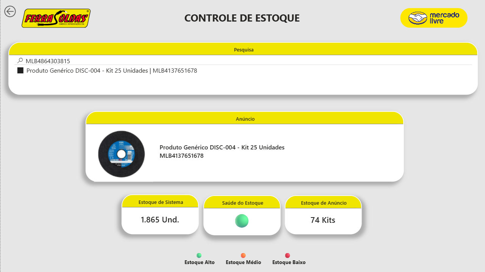
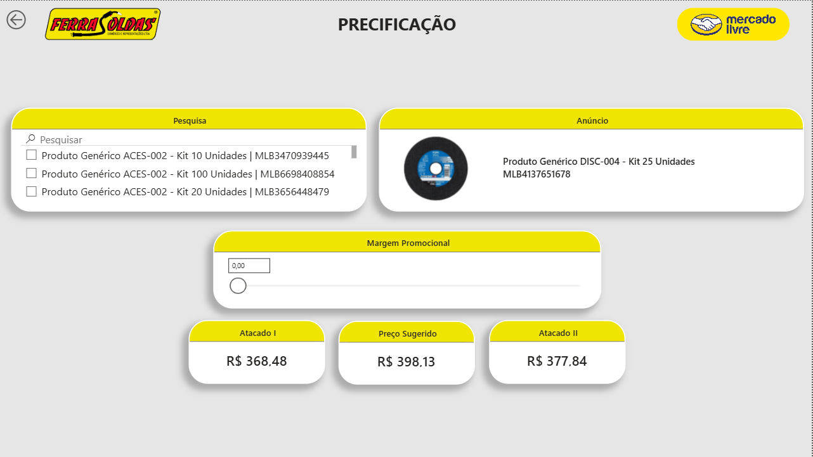
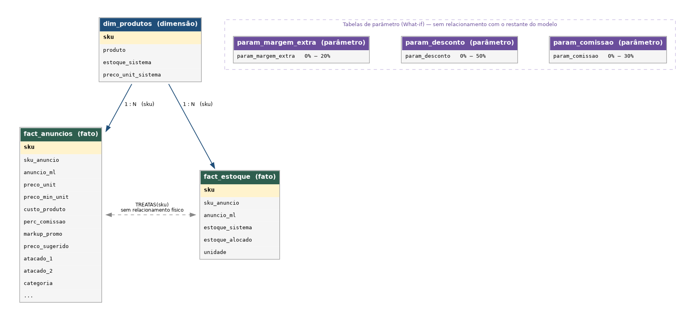

# Simulador de Precificação para Marketplace — Power BI
 
Ferramenta de BI desenvolvida por iniciativa própria para a Ferrasoldas, para apoiar decisões de preço, controle de estoque e mais nos anúncios de Mercado Livre. Nasceu de um problema recorrente da operação: descontos e comissões do marketplace corroendo a margem sem que ninguém percebesse até fechar o mês.
 
O modelo simula, em tempo real, o efeito de diferentes percentuais de desconto e comissão sobre o preço final, o lucro e a margem de cada anúncio — e trava a simulação para nunca deixar o preço cair abaixo do mínimo definido para aquele produto.

## O problema
 
Vendedores de marketplace lidam com uma combinação de variáveis que mudam com frequência: comissão do canal, frete, promoções e descontos aplicados por campanha. Decidir se vale a pena entrar numa promoção, ou até que ponto um desconto ainda é sustentável, normalmente depende de abrir uma planilha e recalcular tudo na mão.
 
Este projeto substitui esse cálculo manual por um painel interativo: o usuário ajusta os parâmetros pelo próprio Power BI e vê o impacto no preço, no lucro e na margem instantaneamente, com alerta visual quando a simulação entra em zona de risco.

## O que o painel faz
 
- **Simulador de preço**: ajusta desconto, comissão e margem extra via slicers e recalcula preço final, receita líquida, lucro e margem em tempo real.
- **Piso de preço protegido**: a simulação nunca deixa o preço cair abaixo do mínimo cadastrado — a medida trava o valor automaticamente.
- **Semáforo de margem**: classificação automática entre prejuízo, margem baixa e margem saudável, com cor condicional nos cartões.
- **Precificação por atacado**: dois níveis de desconto por volume, calculados a partir da mesma base de simulação.
- **Controle de estoque cruzado**: concilia o estoque alocado a cada anúncio com o estoque físico do sistema, usando `TREATAS` para conectar as duas fontes sem duplicar relacionamento no modelo.

## Capturas de tela

<div align="center">
<table>
  <tr>
    <td align="center">
      <br>
      <b>Simulador de precificação</b>
    </td>
    <td align="center">
      <br>
      <b>Controle de estoque</b>
    </td>
  </tr>
  <tr>
    <td align="center">
      <br>
      <b>Precificação</b>
    </td>
    <td align="center">
      <br>
      <b>Promoções</b>
    </td>
  </tr>
</table>
</div>

## Modelo de dados

Estrela clássica: uma dimensão de produtos ligada por SKU a duas tabelas fato (anúncios e estoque), mais três tabelas de parâmetro desconectadas que alimentam os slicers de simulação (What-if).
<div align=center>
<table>
    <tr>
        <td align="center">
            <br>
            <b>Modelo de Dados</b>
        </td>
    </tr>
</table>
</div>

A ligação entre `fact_anuncios` e `fact_estoque` é virtual, feita via `TREATAS` dentro das medidas — não existe relacionamento físico entre as duas tabelas fato no modelo.

## Stack

<div align="center">
  
  
  
  
</div>

**DAX** aplicado com variáveis, `TREATAS`, medidas condicionais e tabelas calculadas What-if. Excel entra como camada de origem dos dados — tabelas estruturadas com fórmulas nativas (`XLOOKUP`, `FORMAT`) que alimentam o modelo via Power Query.

## Estrutura do repositório

```
├── README.md
├── docs/
│   ├── modelo-dados.png
│   ├── dax-measures.md       # descrição de cada medida e a regra de negócio por trás dela
│   └── screenshots/
├── data/
│   └── precificacao_demo.xlsx
└── BI_precificacao_demo.pbix
```

A documentação completa de cada medida — o que ela calcula e por quê — está em [`dax-meansures.md`](docs/dax-meansures.md).

## Sobre os dados

Os valores de custo, estoque, nomes de produto e identificadores de anúncio neste repositório são fictícios. O arquivo de dados foi gerado a partir da base real por um processo de anonimização que preserva a distribuição estatística e a lógica de negócio (proporção entre preço e custo, faixas de estoque, categorias), mas substitui todo dado sensível por valores sintéticos. A estrutura de fórmulas e o modelo de dados são exatamente os usados em produção.

## Autor

Matheus Guimarães — [LinkedIn](https://linkedin.com/in/matheusguimaraesdata) · [GitHub](https://github.com/matheusguimaraesdata)
